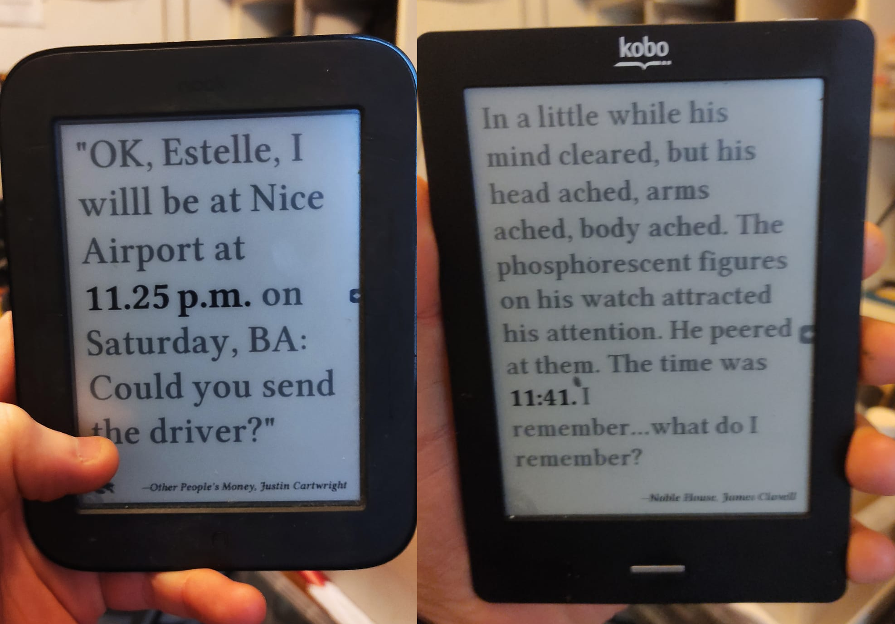

Sorrym broke something. Currently failing, please don't use quite yet

# -literaryclock-kobo-nook
A quick html page to get the fantastic kindle literature clock working on kobo touch and nook touch models running android

Note that I am not yet sure how to disable the screensaver on the nook, so if anyone has any suggestions there, please ask. Thanks.

Using the original guide by  tjaap from 
https://www.instructables.com/Literary-Clock-Made-From-E-reader/

and code from legantalchemist 
https://github.com/elegantalchemist/literaryclock

# literaryclock-kobo-nook-
Converts the original setup into a HTML page that gets it displaying from locally opened html running in the dolphin browser via android.

Non-destructive.

Every time is from a real book quote and the current selection of quotes runs to slightly over 2300+ times for the 1440 minutes of a day. Every quote has the time preserved in it's original written format which means times can vary from 24h clock (1315h) to written format (twenty and seven past three). There are still a number of times still missing and some quotes are vague enough to be used to fill in some gaps."

## Materials
* **Nook Simple running android** 
* **Kobo Touch* for use with SSH and transferring files

## Build Overview
* clone the git or download files
* You need to fill the "meta" folder with the contents of the "metadata" folder within the following zip:
https://content.instructables.com/FC6/C8RE/JK4UL3EC/FC6C8REJK4UL3EC.zip
Which is the "images.zip" file from about half way down this guide https://www.instructables.com/Literary-Clock-Made-From-E-reader/. It's about 60 meg but we only need part of it.  Extract and copy all of the files from inside the "metadata" folder into the "meta" folder
* browse to the file (lit.html) in your file manager and open in dolphin. On the kobo this was not installed, and I used the oldest version from 
 
 I had a frustrating time working out how to set the link to the homepage of dolphin, so this is my guide:
* load it locally with file browser
* hold down on the address bar (but not the second bar that pops up that you enter text in, it needs to be that main top bar)
* When this pops up a menu, choose to bookmark it, then go to a new page.
* add a quicklink and choose your bookmark 
* In the bottom there is a menu with the option for "plugins" over on the right of it. If this menu doesnt show, hit the icon with the 4 squares (menu) and it should show it. 
* In the "plugins" button (why it is in there, i have no idea) click fullscreen. This should now load the page fullscreen. You can use the same 4-squares icon to bring the menu back if you need it.

If you want to add the paths manually (I ran out of patience doing them myself) then my current paths are

for the Nook my path is:
content://mobi.mgeek/TunnyBrowser.htmlfileprovider/mnt/sdcard/docs/lit.html

For the Kobo it is:
content://mobi.mgeek/TunnyBrowser.htmlfileprovider/mnt/media/docs/lit.html

## Credits
* The original project instructables by tjaap - https://www.instructables.com/Literary-Clock-Made-From-E-reader/
* Updated and modified scripts for running it by knobunc - https://github.com/knobunc/kindle-clock
* Hugely expanded list of quotes from JohannesNE - https://github.com/JohannesNE/literature-clock
* Original project ideas and crowdsourced quotes - the Guardian - http://litclock.mohawkhq.com/
* Code and inspiration from elegantalchemist - https://github.com/elegantalchemist/literaryclock

## NSFW Warning- carried over from elegantalchemist's notes:
"A number of the literary quotes contain NSFW language. I have little to no interest in filtering them out and they remain here unredacted. If you wanted to you could do a ctrl+f search and replace for common profanity through the quotes."
